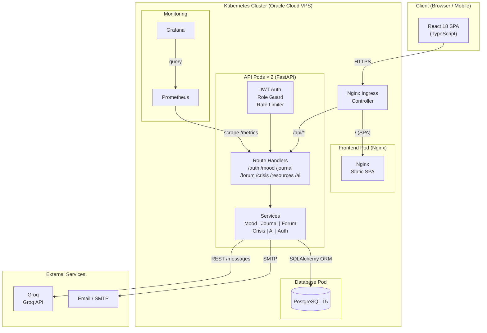
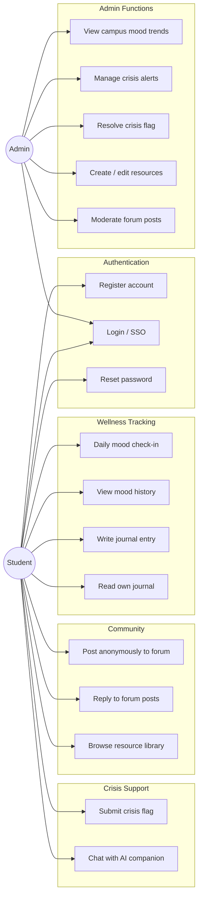
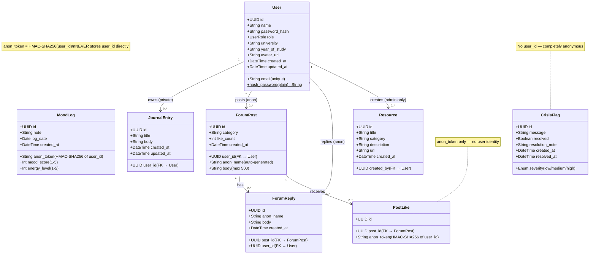
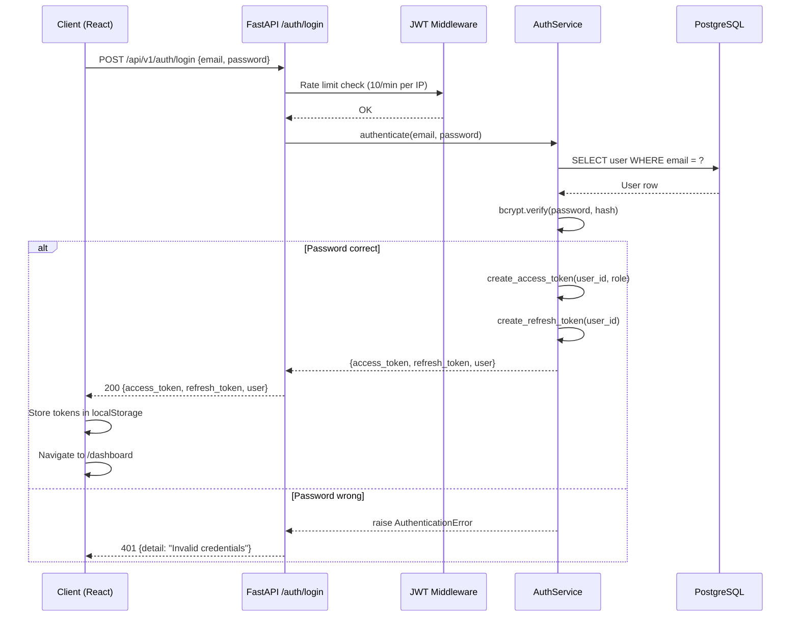
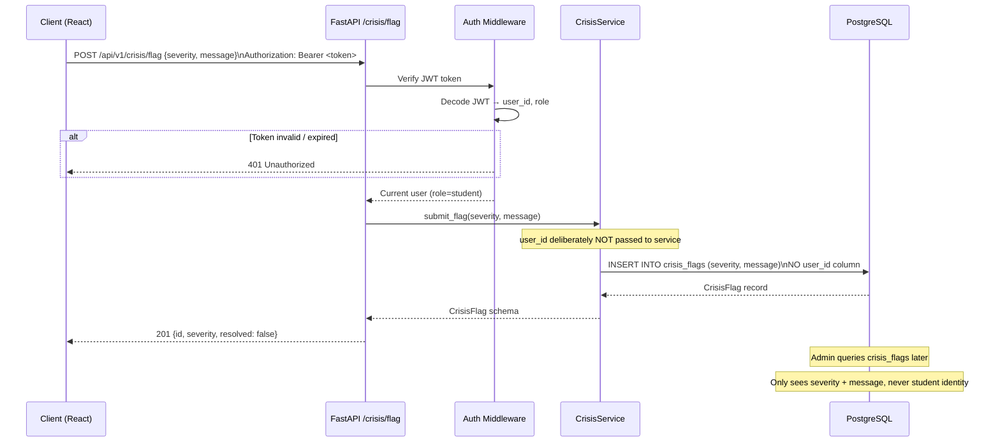
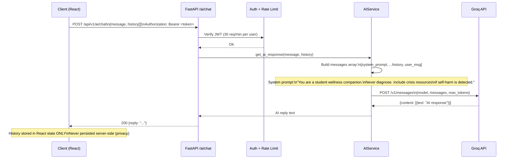
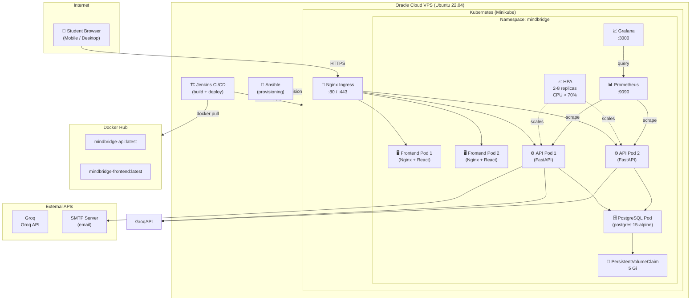

# MindBridge — Software Architecture Document (SAD)
**Course:** SEN3244 Software Architecture  
**Section 8 — Architecture Documentation (20 marks)**  
**Version:** 1.0  | **Date:** May 2026

---

## Table of Contents
1. [System Overview](#1-system-overview)
2. [Architectural Drivers](#2-architectural-drivers)
3. [Architectural Style: Layered N-Tier](#3-architectural-style-layered-n-tier)
4. [Component View](#4-component-view)
5. [Use Case Diagram](#5-use-case-diagram)
6. [Class Diagram — Data Model](#6-class-diagram--data-model)
7. [Sequence Diagrams](#7-sequence-diagrams)
8. [Deployment View](#8-deployment-view)
9. [Security Architecture](#9-security-architecture)
10. [Technology Stack Decisions](#10-technology-stack-decisions)
11. [Quality Attribute Trade-offs](#11-quality-attribute-trade-offs)
12. [Privacy Architecture](#12-privacy-architecture)

---

## 1. System Overview

MindBridge is a campus mental-health platform serving students and administrators at African universities. Students can track their daily mood, write private journal entries, participate in an anonymous peer forum, access wellness resources, escalate a crisis flag, and chat with an AI wellness companion. Administrators view anonymised campus wellbeing trends, manage resources, moderate the forum, and respond to crisis alerts.

**Key constraints:**
- Privacy-first: no individual student data is ever exposed to admins
- Must work on mobile browsers at 4G speeds
- Deployable on a single Oracle Cloud VPS (student budget)
- Team of 4 — 8-week delivery window

---

## 2. Architectural Drivers

| ID | Driver | Category | Priority |
|----|--------|----------|----------|
| AD-01 | Student data must never be accessible to admins (journal, mood) | Security / Privacy | Critical |
| AD-02 | System must serve all registered students simultaneously | Performance / Scalability | High |
| AD-03 | Zero-downtime deployments (rolling updates) | Availability | High |
| AD-04 | New features can be added without refactoring the whole system | Maintainability | High |
| AD-05 | Each layer must be independently unit-testable | Testability | High |
| AD-06 | Deployable by a 4-person student team on a budget VPS | Cost / Operability | Medium |

---

## 3. Architectural Style: Layered N-Tier

### Decision
We chose a **5-layer N-Tier architecture** over microservices or event-driven alternatives.

### Justification

| Option | Pros | Cons | Verdict |
|--------|------|------|---------|
| **N-Tier (chosen)** | Clear separation; easy to test per layer; fits 4-person team; proven pattern | Cannot scale individual features independently | ✅ Chosen |
| Microservices | Independent scaling per service; fault isolation | Massive operational overhead; 4-person team insufficient; network latency between services | ❌ Rejected |
| Event-Driven | Loose coupling; great for async workflows | Complex to debug; overkill for a CRUD-heavy wellness app | ❌ Rejected |

### The Five Layers

```
┌─────────────────────────────────────────────────────────────────┐
│                     PRESENTATION LAYER                          │
│   React 18 + TypeScript SPA   │   Swagger UI (/docs)           │
│   Served by: Nginx (K8s pod)  │   Mobile-first, responsive     │
├─────────────────────────────────────────────────────────────────┤
│                      API / ROUTING LAYER                        │
│   FastAPI route handlers (Python 3.11)                         │
│   JWT Auth Middleware  │  Role-Based Access Control            │
│   Request validation (Pydantic v2)  │  Rate limiting (slowapi) │
├─────────────────────────────────────────────────────────────────┤
│                   BUSINESS LOGIC LAYER                          │
│   MoodService  │  JournalService  │  ForumService              │
│   CrisisService  │  ResourceService  │  AIService              │
│   AuthService  │  EmailService                                  │
├─────────────────────────────────────────────────────────────────┤
│                   DATA ACCESS LAYER                             │
│   SQLAlchemy ORM 2.0  │  Repository pattern                    │
│   Alembic migrations  │  Connection pooling                    │
├─────────────────────────────────────────────────────────────────┤
│                    DATABASE LAYER                               │
│               PostgreSQL 15 (Docker container)                 │
│          PersistentVolumeClaim (Kubernetes)                    │
└─────────────────────────────────────────────────────────────────┘
```

**Rule:** Each layer communicates only with the layer directly below it. Routes call services; services call the DB. No route handler contains SQL; no model contains business logic.

---

## 4. Component View



---

## 5. Use Case Diagram



---

## 6. Class Diagram — Data Model



---

## 7. Sequence Diagrams

### 7.1 — Student Login Flow



### 7.2 — Student Submits Crisis Flag



### 7.3 — AI Wellness Companion Chat



---

## 8. Deployment View



---

## 9. Security Architecture

### Authentication & Authorisation
| Concern | Implementation |
|---------|----------------|
| Password storage | bcrypt (cost factor 12) — never plain-text |
| Session management | JWT access token (24h) + refresh token (30d) |
| Role enforcement | `require_student` / `require_admin` middleware on each route |
| Token transmission | `Authorization: Bearer <token>` header only |
| Google SSO | OAuth 2.0 implicit flow — Google verifies identity, we issue our own JWT |

### Data Security
| Data | Protection |
|------|-----------|
| Database | Not exposed publicly (ClusterIP only, NetworkPolicy blocks external access) |
| Mood logs | `anon_token = HMAC-SHA256(user_id + SECRET_KEY)` — cannot be reversed |
| Journal entries | Linked to `user_id` but `require_student` middleware blocks all admin access |
| Crisis flags | No `user_id` column exists — structurally impossible to identify the student |
| Forum posts | `anon_name` auto-generated (e.g. "Silver Flamingo") — no link to account |
| Post likes | `anon_token` only — same anonymisation as mood logs |
| AI conversations | Not stored server-side at all — client-side only |

### Network Security
```
Internet → Nginx Ingress (TLS termination) → ClusterIP services (no public access)
NetworkPolicy:
  - DB pod: accepts connections ONLY from API pods (port 5432)
  - API pods: accept connections ONLY from frontend pods + ingress-nginx namespace
  - Frontend pods: accept connections ONLY from ingress-nginx namespace
```

---

## 10. Technology Stack Decisions

| Component | Technology | Justification |
|-----------|-----------|---------------|
| Frontend | React 18 + TypeScript | Industry standard; strong typing catches bugs at compile time |
| Build tool | Vite | 10× faster HMR than CRA; native ESM |
| Styling | Tailwind CSS | Utility-first; no CSS drift; small production bundle |
| Backend | FastAPI (Python 3.11) | Async; auto-generates OpenAPI docs; Pydantic validation; 4× faster than Django REST |
| ORM | SQLAlchemy 2.0 | Type-safe; migration support via Alembic; PostgreSQL-optimised |
| Database | PostgreSQL 15 | ACID compliance; JSON column support; proven at scale |
| Auth | PyJWT + bcrypt | Stateless JWT; industry-standard password hashing |
| Testing | PyTest + pytest-cov | Simple fixtures; 81.84% coverage achieved |
| Container | Docker (multi-stage) | Small production images; reproducible builds |
| Orchestration | Kubernetes (Minikube) | Rolling updates; health probes; HPA; NetworkPolicy |
| CI/CD | Jenkins | Declarative pipeline; Docker build + push + K8s deploy |
| Monitoring | Prometheus + Grafana | De-facto standard; prometheus-fastapi-instrumentator auto-instruments endpoints |
| IaC | Ansible | Idempotent server provisioning; no agent required |

---

## 11. Quality Attribute Trade-offs

| Quality Attribute | Decision | Trade-off | Mitigation |
|-------------------|----------|-----------|------------|
| **Performance** | Async FastAPI with 2 uvicorn workers | Cannot use CPU-bound tasks in async handlers | Offload heavy tasks to background workers if needed |
| **Scalability** | Horizontal pod scaling (HPA, min 2 / max 8) | Database is single-instance bottleneck | Database connection pooling (SQLAlchemy pool_size=5) |
| **Security** | Strict NetworkPolicy; anon_token for mood/forum | Adds complexity | Well-documented privacy architecture |
| **Availability** | Rolling update (maxUnavailable=0); 2+ replicas | Rollout takes slightly longer | Acceptable for a campus app |
| **Maintainability** | Strict layer separation; services never in routes | Slightly more boilerplate | Pays dividends when adding features |
| **Cost** | Single VPS + Minikube vs. managed K8s | Limited compute | Sufficient for university scale; can migrate to EKS/GKE later |
| **Testability** | In-memory SQLite for tests; mock DNS + limiter | Test DB ≠ production DB | Critical paths validated with integration tests |

---

## 12. Privacy Architecture

MindBridge is designed so that **no admin can ever identify which student posted what**, even with full database access. This is enforced at the data layer, not just the API layer.

```
User Action                    What is stored in DB
─────────────────────────────────────────────────────────────────
Mood check-in           →  anon_token (HMAC-SHA256 of user_id)
                            mood_score, energy_level, note, date
                            ❌ NOT user_id

Journal entry           →  user_id, title, body
                            ✅ user_id IS stored (needed for privacy)
                            ❌ Blocked at API level — require_student
                               prevents any admin token from accessing

Forum post              →  anon_name (e.g. "Teal Sparrow"), body
                            user_id stored internally but NEVER
                            returned in API responses
                            ❌ NOT visible in GET /forum/posts

Crisis flag             →  severity, message
                            ❌ NOT user_id — column doesn't exist
                            The student is structurally unidentifiable

Post like               →  anon_token (HMAC-SHA256 of user_id)
                            ❌ NOT user_id

AI chat                 →  Not stored at all (client-side only)
```

This architecture satisfies GDPR Article 25 (Data Protection by Design) and the requirement that campus counselors cannot access individual student data without consent.
